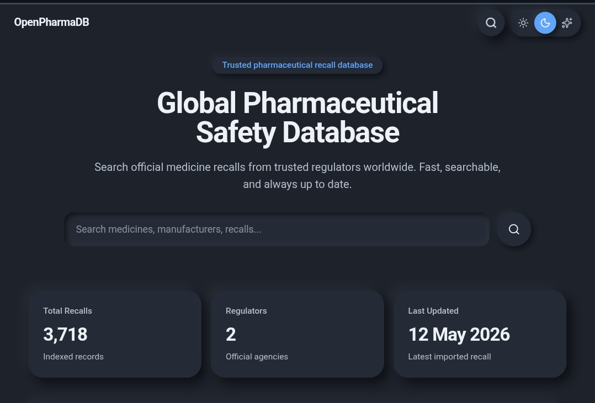

# OpenPharmaDB

[](https://github.com/zehdso/OpenPharmaDB/actions/workflows/test.yml)

A modern, open-source pharmaceutical recall database and web application that aggregates official recall data from multiple regulators into one consistent, searchable platform.

## Live Demo

**Website:** https://openpharmadb.onrender.com

## Preview

[](https://openpharmadb.onrender.com)
---

# Features

- Modern responsive web interface
- Search pharmaceutical recalls instantly
- Dynamic recall detail pages (`/recalls/[id]`)
- Unified JSON schema across regulators
- Official regulator sources only
- Automated normalization and validation
- Extensible architecture for adding new regulators
- GitHub Actions CI
- Open-source dataset

---

# Supported Regulators

| Regulator | Country | Status |
|-----------|---------|--------|
| FDA | United States | ✅ |
| Health Canada | Canada | ✅ |

More regulators will be added over time.

---

# Web Features

- Homepage with latest recalls
- Recall search
- Product filtering
- Responsive mobile layout
- Individual recall pages
- Clean modern UI
- Fast navigation
- Dark mode support
- Static export support (GitHub Pages)
- Full Next.js server support (Render)

---

# Architecture

```text
Official Regulator
        │
        ▼
 Download Raw Data
        │
        ▼
 Filter Relevant Records
        │
        ▼
 Normalize
        │
        ▼
 Merge
        │
        ▼
 Validate
        │
        ▼
 Published Dataset
        │
        ▼
 Next.js Web Application
```

---

# Repository Structure

```text
OpenPharmaDB/
├── assets/
│   └── preview.png
├── data/
│   ├── raw/
│   ├── normalized/
│   └── published/
├── schemas/
├── scripts/
│   ├── core/
│   └── regulators/
├── tests/
├── web/
│   ├── app/
│   ├── components/
│   ├── lib/
│   └── public/
├── .github/
│   └── workflows/
├── openpharmadb.py
└── README.md
```

---

# Installation

Clone the repository.

```bash
git clone https://github.com/zehdso/OpenPharmaDB.git
```

Move into the project.

```bash
cd OpenPharmaDB
```

Install Python dependencies.

```bash
pip install requests fastjsonschema pytest
```

Install web dependencies.

```bash
cd web
npm install
```

---

# Running the Web App

Development server:

```bash
npm run dev
```

Production build:

```bash
npm run build
```

Start production server:

```bash
npm start
```

---

# Generate Dataset

Generate FDA data.

```bash
python -m scripts.regulators.fda
```

Generate Health Canada data.

```bash
python -m scripts.regulators.health_canada
```

Merge datasets.

```bash
python -m scripts.core.merge
```

Validate datasets.

```bash
python -m scripts.core.validate
```

Run tests.

```bash
pytest
```

---

# CLI Usage

Search recalls.

```bash
python openpharmadb.py ibuprofen
```

Filter by regulator.

```bash
python openpharmadb.py --regulator FDA
```

Filter by country.

```bash
python openpharmadb.py --country CA
```

Limit results.

```bash
python openpharmadb.py ibuprofen --limit 5
```

---

# Dataset Schema

Every record follows a unified schema.

```json
{
  "schema_version": 1,
  "id": "",
  "regulator": "",
  "country": "",
  "title": "",
  "product": "",
  "category": "",
  "classification": "",
  "reason": "",
  "recall_date": "",
  "url": null,
  "extras": {}
}
```

---

# Goals

- Aggregate official pharmaceutical recall information
- Standardize data across regulators
- Preserve regulator-specific metadata
- Enable research and analytics
- Provide a stable public dataset
- Power modern web applications
- Support future APIs

---

# Roadmap

- Additional international regulators
- Advanced search
- Product categories
- REST API
- Python package
- Incremental updates
- Better analytics
- Downloadable datasets
- Recall notifications
- Release automation

---

# Technologies

### Backend

- Python
- Requests
- FastJSONSchema

### Frontend

- Next.js 16
- React
- TypeScript
- Tailwind CSS
- Framer Motion

### Deployment

- Render
- GitHub Pages
- GitHub Actions

---

# Contributing

Contributions are welcome.

1. Fork the repository.
2. Create a feature branch.
3. Commit your changes.
4. Push your branch.
5. Open a Pull Request.

---

# License

This project is licensed under the MIT License.